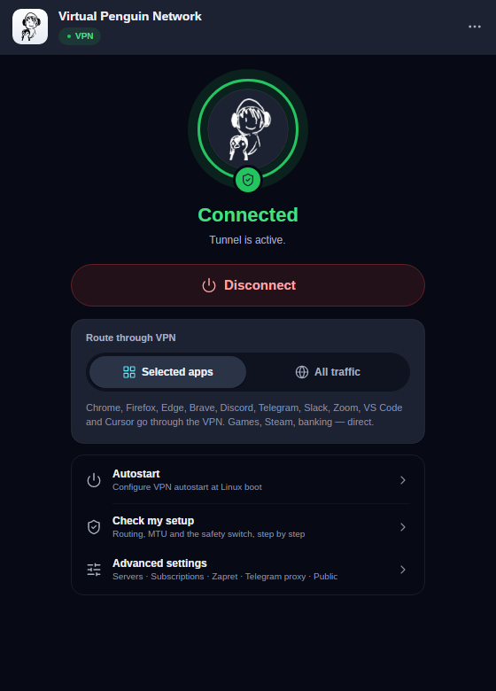
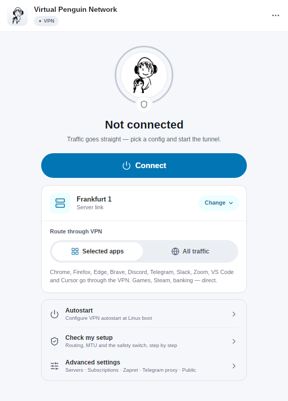
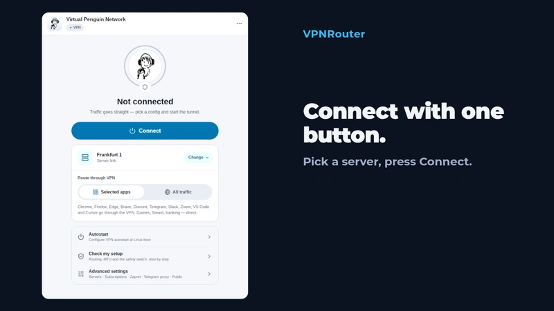
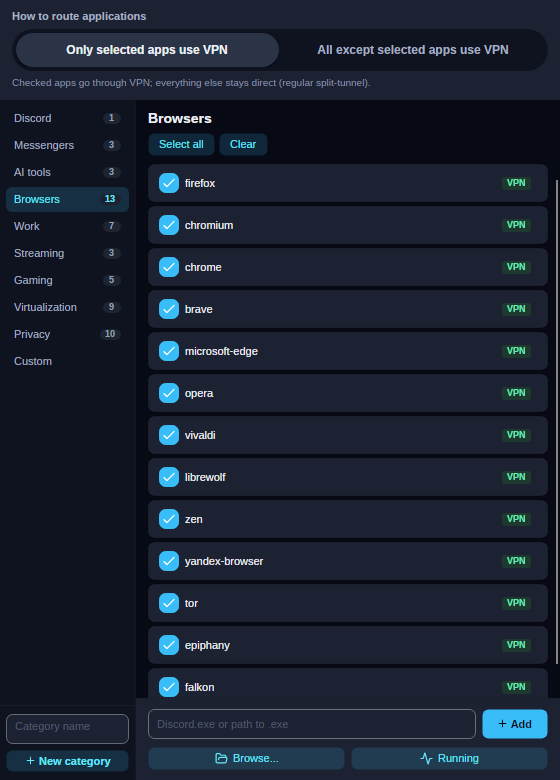

<p align="center">
  
</p>

<h1 align="center">VPNRouter</h1>
<p align="center"><b>Virtual Penguin Network</b> — a split-tunnel VPN router: only the apps you choose go through the VPN. Windows, macOS, Linux and Android.</p>

<p align="center">
  <a href="README.md"><b>English</b></a> · <a href="README.ru.md">Русский</a>
</p>

<p align="center">
  <b><a href="https://github.com/PavelLizunov/VPNRouter/releases/latest">Download the latest release</a></b> ·
  <a href="https://github.com/PavelLizunov/VPNRouter/releases">All releases, including candidates</a> ·
  <a href="#install">Install</a>
</p>

<p align="center">
  
  
</p>
<p align="center"><sub>Rendered from the current build with sample data: no real servers or accounts.</sub></p>

<p align="center">
  <a href="https://github.com/PavelLizunov/VPNRouter/releases/latest"></a>
  <a href="https://github.com/PavelLizunov/VPNRouter/releases"></a>
  <a href="LICENSE"></a>
  
</p>

## Install

**Windows 10/11 (x64)**, in PowerShell:

```powershell
iwr -useb https://vpn.ninitux.com/install.ps1 | iex
```

Or use the setup wizard `VPNRouter-Setup-v{version}.exe` from [Releases](https://github.com/PavelLizunov/VPNRouter/releases). Windows builds are not code-signed, so compare a download with its `.sha256` file ([why](docs/guide/privacy-and-trust.md)).

**macOS (Apple Silicon)**:

```bash
brew install --cask pavellizunov/vpnrouter/vpnrouter
```

**Debian, Ubuntu, Mint** (signed apt repository):

```bash
curl -fsSL https://vpn.ninitux.com/install.sh | sudo sh
```

**Android 6.0+ (ARM64)**: download `VPNRouter-v{version}-android-arm64.apk` from [Releases](https://github.com/PavelLizunov/VPNRouter/releases) and install it outside Google Play. The app offers updates itself.

ZIP, DMG, AppImage, `.deb` and `.tar.gz` downloads, requirements and checksums: [Install and download](docs/guide/install.md).

## What it does

- **Per-application routing.** Choose the apps that go through the proxy, or everything except them. It uses [sing-box](https://github.com/SagerNet/sing-box) TUN mode, so apps need no proxy settings.
- **Your own servers.** VLESS+Reality, or custom sing-box JSON (TUIC, Hysteria2, Shadowsocks). Subscriptions merge into one server pool.
- **Server tests.** A one-click TCP+TLS probe, and deep verification (HTTP round trip and a 5 MB bandwidth test).
- **Desktop extras.** A setup and diagnostics wizard, safe rollback to a previous stable version, Russian and English interface.
- **Optional on Windows.** DPI bypass (Zapret) and a Telegram proxy. The Free Configs tab lists public VLESS endpoints run by third parties.

More: [Features](docs/guide/features.md).

## See it work

<p align="center">
  
</p>
<p align="center">
  
</p>

## Documentation

- [Features](docs/guide/features.md)
- [Install and download](docs/guide/install.md)
- [Build from source](docs/guide/building.md)
- [Architecture and how it works](docs/guide/architecture.md)
- [Privacy, trust and code signing](docs/guide/privacy-and-trust.md)
- [Credits](docs/guide/credits.md)
- [Current build and platform state](CURRENT_STATE.md)

The guide pages are in English; Russian versions are in [docs/guide/ru](docs/guide/ru/install.md).

## Privacy and trust

This is a VPN client, so verify the code before trusting it. Crash reports stay on your machine and are never uploaded automatically. Settings and generated configurations contain connection credentials: do not publish them or raw logs. SHA256 files prove that a download matches its hash, not who published it. Report security problems privately: see [SECURITY.md](SECURITY.md).

## License

[GPL-3.0-or-later](LICENSE) © 2026 Pavel Lizunov. Forks that distribute binaries must publish their source under the same license.
