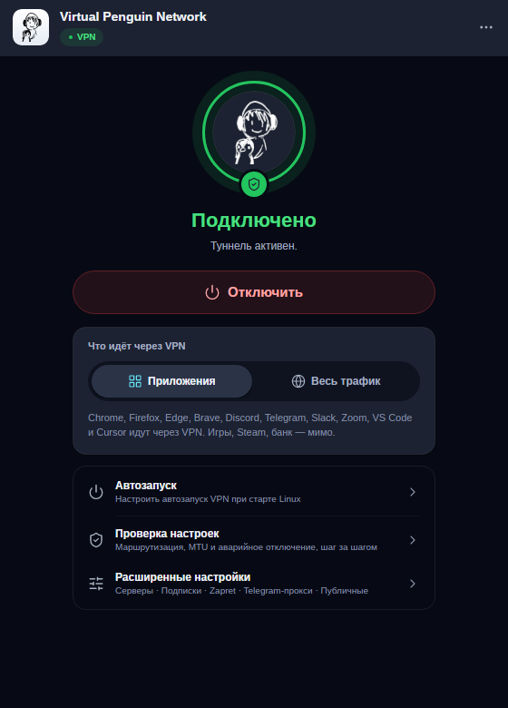
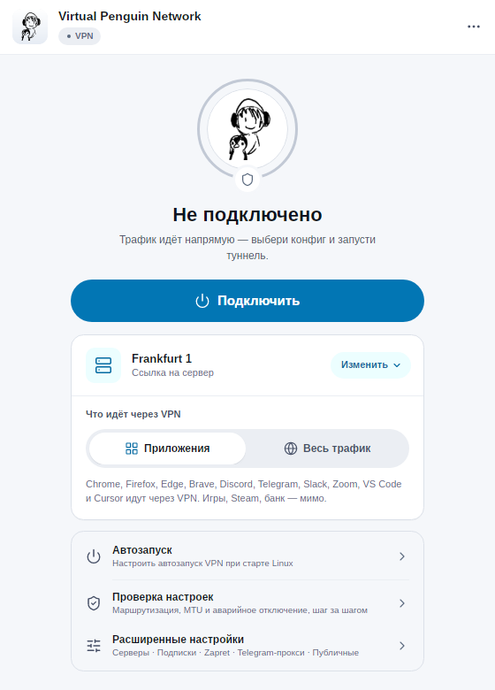
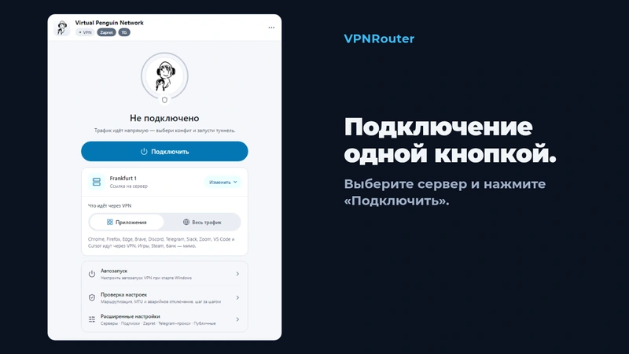
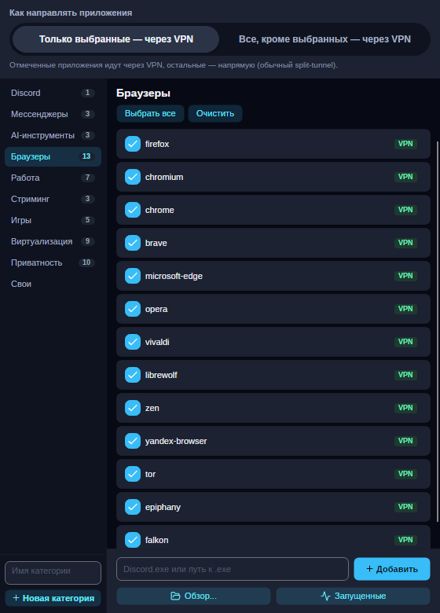

<p align="center">
  
</p>

<h1 align="center">VPNRouter</h1>
<p align="center"><b>Virtual Penguin Network</b> — split-tunnel VPN-роутер: через VPN идут только выбранные вами приложения. Windows, macOS, Linux и Android.</p>

<p align="center">
  <a href="README.md">English</a> · <a href="README.ru.md"><b>Русский</b></a>
</p>

<p align="center">
  <b><a href="https://github.com/PavelLizunov/VPNRouter/releases/latest">Скачать последний релиз</a></b> ·
  <a href="https://github.com/PavelLizunov/VPNRouter/releases">Все релизы, включая кандидаты</a> ·
  <a href="#установка">Установка</a>
</p>

<p align="center">
  
  
</p>
<p align="center"><sub>Снимки текущей сборки на тестовых данных: без настоящих серверов и аккаунтов.</sub></p>

<p align="center">
  <a href="https://github.com/PavelLizunov/VPNRouter/releases/latest"></a>
  <a href="https://github.com/PavelLizunov/VPNRouter/releases"></a>
  <a href="LICENSE"></a>
  
</p>

## Установка

**Windows 10/11 (x64)**, в PowerShell:

```powershell
iwr -useb https://vpn.ninitux.com/install.ps1 | iex
```

Или мастер установки `VPNRouter-Setup-v{version}.exe` со страницы [Releases](https://github.com/PavelLizunov/VPNRouter/releases). Windows-сборки не подписаны, поэтому сверяйте загрузку с файлом `.sha256` ([почему](docs/guide/ru/privacy-and-trust.md)).

**macOS (Apple Silicon)**:

```bash
brew install --cask pavellizunov/vpnrouter/vpnrouter
```

**Debian, Ubuntu, Mint** (подписанный apt-репозиторий):

```bash
curl -fsSL https://vpn.ninitux.com/install.sh | sudo sh
```

**Android 6.0+ (ARM64)**: скачайте `VPNRouter-v{version}-android-arm64.apk` со страницы [Releases](https://github.com/PavelLizunov/VPNRouter/releases) и установите его вне Google Play. Приложение само предложит обновление.

ZIP, DMG, AppImage, `.deb` и `.tar.gz`, требования и контрольные суммы: [Установка и загрузка](docs/guide/ru/install.md).

## Что делает

- **Маршрутизация по приложениям.** Выберите приложения, которые идут через прокси, или все, кроме них. Работает через TUN-режим [sing-box](https://github.com/SagerNet/sing-box), настраивать прокси в приложениях не нужно.
- **Ваши серверы.** VLESS+Reality или собственный sing-box JSON (TUIC, Hysteria2, Shadowsocks). Подписки сливаются в один пул серверов.
- **Проверка серверов.** TCP+TLS-проба в один клик и глубокая проверка (HTTP-запрос и тест скорости на 5 МБ).
- **Для десктопа.** Мастер настройки и диагностики, безопасный откат на предыдущую стабильную версию, интерфейс на русском и английском.
- **Необязательно на Windows.** Обход DPI (Zapret) и Telegram-прокси. Вкладка Free Configs показывает публичные VLESS-точки, которые держат третьи лица.

Подробнее: [Возможности](docs/guide/ru/features.md).

## Как это выглядит

<p align="center">
  
</p>
<p align="center">
  
</p>

## Документация

- [Возможности](docs/guide/ru/features.md)
- [Установка и загрузка](docs/guide/ru/install.md)
- [Сборка из исходников](docs/guide/ru/building.md)
- [Архитектура и принцип работы](docs/guide/ru/architecture.md)
- [Приватность, доверие и подпись кода](docs/guide/ru/privacy-and-trust.md)
- [Благодарности](docs/guide/ru/credits.md)
- [Текущее состояние сборок и платформ](CURRENT_STATE.md)

Английские версии страниц лежат в [docs/guide](docs/guide/install.md).

## Приватность и доверие

Это VPN-клиент, поэтому перед доверием проверьте код. Отчёты о сбоях остаются на вашем компьютере и никогда не отправляются автоматически. Настройки и сгенерированные конфигурации содержат параметры доступа: не публикуйте их и необработанные логи. SHA256-файлы подтверждают, что загрузка совпадает с хешем, но не кто её опубликовал. О проблемах безопасности сообщайте приватно: см. [SECURITY.md](SECURITY.md).

## Лицензия

[GPL-3.0-or-later](LICENSE) © 2026 Pavel Lizunov. Форки, распространяющие бинарники, должны публиковать свой исходный код под той же лицензией.
